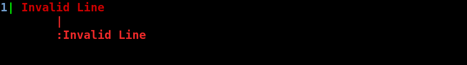

# Welcome to Pbss Documentation!
This is the official documentation for Pbss and has been rewritten for Pbss's second version from the ground up. The older documentation has been depricated and no longer available for viewing or use. The below table lists all major links to this document

**Table of Contents**
1. [Overview](#overview)
2. [What's new in Pbss 2.0](#release-info)
3. [Installation](#install)
    * [Windows](#install-win)
    * [Linux](#install-linux)
    * [MacOS](#install-osx)
4. [Running](#running)
5. [Parts of Pbss](#parts)
6. [Feature Explanantions](#explainations)
    * [Traditional CSS](#old-css)
    * [Variables](#vars)
    * [Including multiple files](#other-files)
    * [Error Handling](#error-catching)


## <a name="overview"></a> 1. What is Pbss
Pbss is an attempt to improve on CSS 3 by providing better support for variables, breaking code into multiple files, error catching and lots of other features so that our users never feel the old boring CSS. More effectively said it is a preprocessor for CSS.  
Pbss is written in hte Rust programming language and is completely free to use for any purpose and licensed under the very permissive MIT License

## <a name="release-info"></a> 2. What's new in Pbss 2.0
Pbss 2.0 is the greatest release in the history of Pbss, since it had been rewritten in Rust. Prior to Pbss 1.2, Pbss was written in Python but was replaced with Rust due to its memory safty, better concurrency features, speed and robustness. Although the release did not supported all the features after it was started in rewriting but it did catched up in this release. It gave robust support for the following features
- Variables
- Dividing the source code into multiple files
- It made the later stages of developemnt much easier
- It no longer depends on the Python dictionary format to get the stylesheet
- It used multiple threads for better efficiency
- It provided easy error catching and wrote it to terminal in nicde manner

Although it lacked the features that its predecessors had brought to the table like
- It did not supported color arithmetic
- It cannot perform calculations
- It did not provide native support for colors
- It did not provide support for functions

## <a name="install"></a>3. Installation
Pbss is quite simple to install. Go to the releases page and download the executable for your OS. For Windows and MacOS, download the *.zip* file, for Linux download the *.tar.gz* file. **Please do not download the source code files**. Once down follow these instructions

### <a name="install-win"></a>Windows
* Put the executable in a place that you like. For example C:\Users\\[YOUR-USERNAME]\pbss.
* Now open the start menu and type *env* in your search bar and clicking on PATH.
* Now add the the path to the folder where you stored the binary by adding a colon(:) and then putting the path to the directory

### <a name="install-linux"></a>Linux
* Put the executable in a place you like. Most Linux/UNIX users pu binaries in a folder in their home directory named *bin*. But you can use anything
* Now in most Linux distributions like Ubuntu, this should show allow you to run Pbss, but if it doesn't add this line to any of your profile files, like .profile, .bashrc, .bash_profile, .zshrc, .zsh_profile

```
	export PATH="$PATH:$HOME/bin/"
```
* This adds your home directory's bin folder to a variable called $PATH which is read by shells for getting program names. If you chose to use another directory, replace the contents after the color(:) with your own directory path

### <a name="install-osx"></a>MacOS
* Put the executable in a suitable directory like in your home directory's bin directory or you can crate a pbss directory
* Add this to your *.bashrc*

```
	export PATH="$PATH:$HOME/bin/"
```
* This adds your home directory's bin folder to a variable called $PATH which is read by shells for getting program names. If you chose to use another directory, replace the contents after the color(:) with your own directory path

## <a name="running"></a>5. Running
Pbss can be run with many options
* A basic run to compile a *test1.pbss* file to a *test2.css* file
    ``` sh
    pbss test1.pbss test2.css
    ```
    This will compile and write this to the console
    ```
    Compiled test1.pbss into test2.css
    ```
    If any errors were found, they will be reported. See [Error Catching](#error-catching)

* If you want do not want the output to be sent to a file and instead want to put it in the standard output of your terminal, replace *test2.css* with *:s*
    ``` sh
    pbss test1.pbss :s
    ```
    If any errors were found, they will be reported. See [Error Catching](#error-catching)

* If you don't want to continuously run Pbss to compile your file, each time you make changes, you can use the `-w` or `--watch` flag. This will automatically compile your file each time you make changes and save your file
    ``` sh
    pbss test1.pbss test2.css
    ```

* If Pbss finds that a file with a similar name to the writing file exists in the file system, it will prompt for confirmation
    ```
    It seems test2.css already exists in file system. Do you want to override the file[Y/n]
    ```
    The default is yes
    If you want to disable such prompts, you can put the `--override` the option to Pbss

    ``` sh
    pbss --override test1.pbss test2.css
    ```
    This will stop any prommpts for confirmation of writing files existing in file system


* When a file is compiled, Pbss will output a messgae like this
    ```
    Compiled test1.pbss into test2.css
    ```
    If you want to stop such messages, you can put the `-q` flag or `--quiet` flag

    ```
    pbss -q test1.pbss test2.css
    ```
    **Note that this desen't stop errors from being printed out**

## <a name="parts"></a>5. Parts of Pbss
Pbss although has only one executabes and does not require any external libraries, has been affectionately been divided into two parts:-
* **Pbss:** which is the actual executable and frontend
* **Mynk:** the parser and compiler and writer engine. Mynk goes through the file line by line, classifies the type of line and performs actions that need to be taken for the line and report errors, if the line is considered invalid

## <a name="explainations"></a>6. Features Explainations
### <a name="old-css"></a> Traditional CSS
CSS is written in the same way as you have always been writing, for example let's change the background color of body, set the width of all div tags to `100px` and increaes the font size to `2em`

``` CSS
* {
    font-size: 2em; /* All elements have a font size of 2em */
}
body {
    background: rgb(255,255,255); /* White background */
}
div {
    width: 100px; /* Height of all divs will be 100px */
}
```

### <a name="vars"></a>Variables
To use variables in Pbss, you must keep some points in mind:-
* Variables must be defined outside any style blocks
* Variable definition must start with a dollor($) and end with a semicolon(;)
* A aariable has two parts:-
    * **Identifier:** It is used to uniquely identify, store and retrieve a value
    * **Value:** It is the actual value that needs to be replaced in place of the variable

Let's look at an example
```
$font-color: rgb(200,153,216);
```
In order to use a variable, use the dollor and the identifier without any spaces
```
div {
    color: $font-color;
}
```
Final code:-
```
$font-color: rgb(200,153,216);
div {
    color: $font-color;
}
```
The resulting code will be this
``` css
div {
    color: rgb(200,153,216);
}
```

### <a name="other-files"></a>Including other files
It becomes a real tedious job when you have all styles in one place, CSS by default does not allow you to split code in multiple files and you have to edit the HTML sources, which is mostly already very cluttered.  
Enter Pbss's ***include()*** function. This function not only includes the styles, but also its variables, and other included files of the included file. Let's take a real world example

Let's say you have two files, *main.pbss* and *master.pbss*, and you want to include everything of *master.pbss* in *main.pbss*, well let's use the `include()` function. In *main.pbss*, add this to the top of the file
*main.pbss* contains the following code

```
.generic-div-class {
    height: $div-height;
}
```
Let's say *master.pbss* has this in it
```
$div-height: 100px;

#my-special-dev {
    height: $div-height;
}
```
Already you can see that `$div-height` is defined in *master.pbss*, so to include it in *main.pbss*, write this code at the top of *main.pbss*
```
include(master.pbss)
```
Now if you compile *main.pbss*, you get this
``` css
#my-special-dev {
    height: 100px;
}
.generic-div-class {
    height: 100px;
}
```
How cool!! Something you should follow is to always put all includes in the top, because if you put it in bottom, some styles may be overriden, not by Pbss but by browsers  
**Also if you use variables, their definition files must be included first before use.**

### <a name="error-catching"></a>Error Catching
Pbss can catch invalid lines you may have mistyped in your file. For rxample, let's write this is a file
```
This is an invalid line
```
When you run, Pbss this is printed to the stderr



Pbss actually tells you the line number of the error and what the line is.  
**Note the colon(:) and the pipe(|) in red in the lines below are just for asthetics. They do not tell where error occuered**